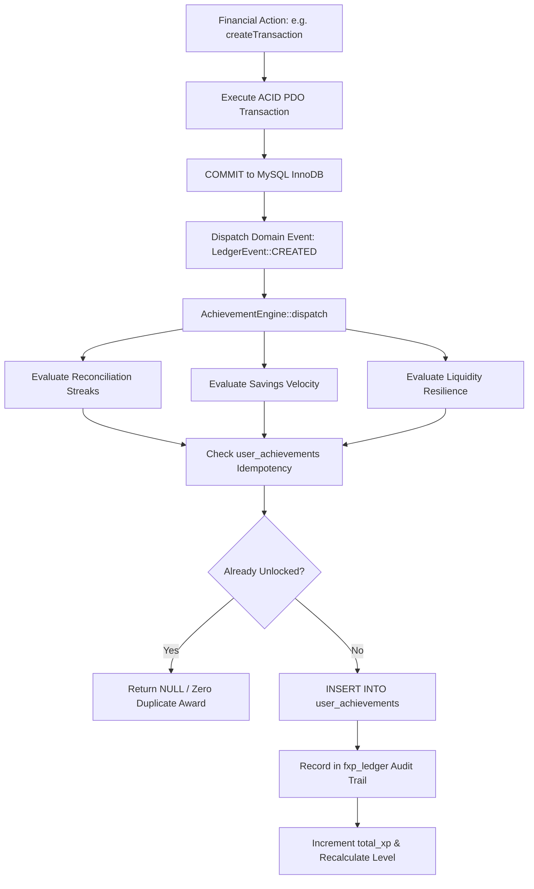

# ExpensePro Gamification & Achievement Architecture

> **Institutional-Grade Financial Discipline, Exploit-Resistant Streaks, & Decoupled Event Progression**  
> *Engineered to prevent CRUD farming, ensure calendar-accurate streaks, and enforce mathematical leveling curves.*

---

## Table of Contents
- [Executive Overview](#executive-overview)
- [Anti-Exploit Invariants & Ledger Design](#anti-exploit-invariants--ledger-design)
- [Mathematical Progression Curves](#mathematical-progression-curves)
  - [Leveling Power Curve Formula](#leveling-power-curve-formula)
  - [Level & Wealth Title Progression Matrix](#level--wealth-title-progression-matrix)
- [Structured Achievement Catalog (The 4 Core Tracks)](#structured-achievement-catalog-the-4-core-tracks)
  - [Track 1: Budget Disciplinarian](#track-1-budget-disciplinarian)
  - [Track 2: Savings Velocity](#track-2-savings-velocity)
  - [Track 3: Reconciliation Master](#track-3-reconciliation-master)
  - [Track 4: Debt & Liquidity Resilience](#track-4-debt--liquidity-resilience)
- [Decoupled Domain Event Pipeline](#decoupled-domain-event-pipeline)
- [Transaction Reversal & Automated Clawbacks](#transaction-reversal--automated-clawbacks)
- [Developer Integration & Code Examples](#developer-integration--code-examples)

---

## Executive Overview

Conventional personal finance trackers implement naive gamification: creating an arbitrary transaction grants immediate XP, encouraging **CRUD farming** (users repeatedly creating, modifying, and deleting transactions to farm badges, levels, and streaks).

ExpensePro v3.0 tears down and re-architects gamification from the ground up:
1. **Decoupled Asynchronous Events:** Core ledger mutations write to InnoDB tables first. Gamification listeners evaluate achievements asynchronously via `AchievementEngine::dispatch()`.
2. **Immutable Composite Ledger:** Achievements are recorded in `user_achievements` backed by a unique composite constraint `(user_id, achievement_key)`. An achievement can never be double-awarded.
3. **Automated Reversal Clawbacks:** If a transaction that satisfied an achievement is deleted or reversed, the engine atomically revokes the achievement, claws back the awarded FXP, and recalculates the user's level.
4. **Calendar Day Normalization:** Streaks are calculated using `DATE(transaction_date)` across distinct calendar days, making streak mechanics completely immune to multiple entries on the same day or manual timestamp tampering.

---

## Anti-Exploit Invariants & Ledger Design

### Invariant 1: Idempotent Single-Unlock
An achievement cannot be earned more than once per user lifetime:
```sql
CREATE TABLE `user_achievements` (
    `id` BIGINT UNSIGNED AUTO_INCREMENT PRIMARY KEY,
    `user_id` INT UNSIGNED NOT NULL,
    `achievement_key` VARCHAR(64) NOT NULL,
    `unlocked_at` TIMESTAMP NULL,
    `source_reference_id` VARCHAR(64) NULL,
    `fxp_awarded` INT NOT NULL DEFAULT 0,
    `is_revoked` TINYINT(1) NOT NULL DEFAULT 0,
    `revoked_at` TIMESTAMP NULL,
    UNIQUE KEY `uniq_user_achievement_key` (`user_id`, `achievement_key`)
);
```

### Invariant 2: Audit Trail Isolation
Every FXP delta writes to `fxp_ledger` with a unique event reference:
```sql
INSERT INTO fxp_ledger (user_id, event_type, reference_id, fxp_amount, created_at)
VALUES (1, 'achievement_unlock', 'budget_disciplinarian_1m', 150, NOW())
ON DUPLICATE KEY UPDATE fxp_amount = VALUES(fxp_amount);
```

### Invariant 3: Zero-Tolerance Reversal Propagation
When transaction #1042 is reversed:
1. All achievements linked via `source_reference_id = 'txn_1042'` are marked `is_revoked = 1`.
2. A negative adjustment entry (`-fxp_awarded`) writes to `fxp_ledger`.
3. `user_financial_stats.total_xp` is decremented by the exact clawback sum.
4. The user level recalculates down if the threshold is no longer met.

---

## Mathematical Progression Curves

### Leveling Power Curve Formula

User rank progression follows a predictable super-linear power curve:

$$\text{Required FXP}(L) = \lfloor 100 \times L^{1.5} \rfloor$$

To advance from Level $L$ to Level $L+1$, the user must accumulate total cumulative FXP meeting or exceeding the threshold:

$$\text{Threshold}(L+1) = \lfloor 100 \times L^{1.5} \rfloor$$

### Level & Wealth Title Progression Matrix

| Level ($L$) | Base FXP | Target Threshold to $L+1$ | Level FXP Span | Wealth Tier Title |
| :--- | :--- | :--- | :--- | :--- |
| **Level 1** | `0` | `100` | `100 FXP` | *Financial Novice* |
| **Level 2** | `100` | `282` | `182 FXP` | *Financial Novice* |
| **Level 3** | `282` | `519` | `237 FXP` | *Financial Novice* |
| **Level 4** | `519` | `800` | `281 FXP` | *Financial Novice* |
| **Level 5** | `800` | `1,118` | `318 FXP` | *Prudent Saver* |
| **Level 10** | `2,846` | `3,162` | `316 FXP` | *Budget Architect* |
| **Level 15** | `5,238` | `5,809` | `571 FXP` | *Wealth Strategist* |
| **Level 20** | `8,268` | `8,944` | `676 FXP` | *Master Disciplinarian* |
| **Level 30** | `15,617` | `16,431` | `814 FXP` | *Financial Vanguard* |
| **Level 40** | `24,357` | `25,298` | `941 FXP` | *Grand Capitalist* |
| **Level 50+** | `34,297` | `35,355` | `1,058 FXP` | *Sovereign Titan* |

---

## Structured Achievement Catalog (The 4 Core Tracks)

### Track 1: Budget Disciplinarian
Rewards users for establishing spending ceilings and operating within them across complete calendar months.

| Achievement Key | Display Name | Trigger Criteria | FXP | Rarity | Icon |
| :--- | :--- | :--- | :--- | :--- | :--- |
| `budget_disciplinarian_1m` | **Budget Discipline (1 Month)** | 1 full calendar month where total categorical spending $\le$ budget limits. | `150` | Common | `fa-shield-halved` |
| `budget_disciplinarian_3m` | **Budget Vanguard (3 Months)** | 3 consecutive calendar months without a single category overrun. | `500` | Rare | `fa-chess-rook` |
| `budget_disciplinarian_6m` | **Master Disciplinarian (6 Months)**| 6 consecutive calendar months of flawless envelope budget adherence. | `1,200` | Epic | `fa-crown` |

**Evaluation Formula:**
$$\text{Clean Month} \iff \forall c \in \text{Categories}: \text{Spent}(c) \le \text{Allocated}(c) + \text{RolledOver}(c)$$

---

### Track 2: Savings Velocity
Rewards positive cash flow retention and frugality relative to gross earnings.

| Achievement Key | Display Name | Trigger Criteria | FXP | Rarity | Icon |
| :--- | :--- | :--- | :--- | :--- | :--- |
| `savings_velocity_20` | **Capital Builder (20% Rate)** | Net savings rate $\ge 20.0\%$ over a completed monthly billing period. | `200` | Common | `fa-arrow-trend-up` |
| `savings_velocity_40` | **Velocity Accumulator (40% Rate)**| Net savings rate $\ge 40.0\%$ over a completed monthly billing period. | `600` | Rare | `fa-bolt` |
| `savings_velocity_60` | **Sovereign Wealth (60% Rate)** | Net savings rate $\ge 60.0\%$ over a completed monthly billing period. | `1,500` | Legendary | `fa-gem` |

**Evaluation Formula:**
$$\text{Savings Rate} = \left( \frac{\text{Net Monthly Income} - \text{Total Monthly Expenses}}{\text{Net Monthly Income}} \right) \times 100$$

---

### Track 3: Reconciliation Master
Encourages daily financial mindfulness. Immune to intraday duplicate entries.

| Achievement Key | Display Name | Trigger Criteria | FXP | Rarity | Icon |
| :--- | :--- | :--- | :--- | :--- | :--- |
| `reconciliation_master_7d` | **Reconciliation Novice (7 Days)** | Verified ledger activity across 7 distinct consecutive calendar days. | `100` | Common | `fa-calendar-check` |
| `reconciliation_master_30d`| **Ledger Guardian (30 Days)** | Continuous daily reconciliation across 30 consecutive calendar days. | `450` | Rare | `fa-book-bookmark` |
| `reconciliation_master_90d`| **Auditing Virtuoso (90 Days)** | Flawless 90-day unbroken daily logging streak. | `1,500` | Epic | `fa-certificate` |

**Evaluation Formula:**
$$\text{Streak} = \left| \{ d \in \text{Distinct Calendar Dates} \mid d_{i} - d_{i+1} = 1 \text{ day} \} \right|$$

---

### Track 4: Debt & Liquidity Resilience
Measures financial runway and emergency preparedness by comparing vault reserves against living costs.

| Achievement Key | Display Name | Trigger Criteria | FXP | Rarity | Icon |
| :--- | :--- | :--- | :--- | :--- | :--- |
| `liquidity_resilience_3m` | **Liquidity Fortress (3 Months)** | Emergency vault reserves covering $\ge 3$ months of baseline expenses. | `800` | Rare | `fa-vault` |
| `liquidity_resilience_6m` | **Ironclad Solvency (6 Months)** | Emergency vault reserves covering $\ge 6$ months of baseline expenses. | `2,000` | Legendary | `fa-monument` |

**Evaluation Formula:**
$$\text{Liquidity Coverage Ratio} = \frac{\sum(\text{Active Vault Balances})}{\frac{1}{3} \sum_{m=1}^{3} \text{Monthly Expenses}_m} \ge 3.0 \text{ or } 6.0$$

---

## Decoupled Domain Event Pipeline

All gamification evaluations execute asynchronously after core database commits via `App\Services\AchievementEngine::dispatch()`:



---

## Transaction Reversal & Automated Clawbacks

If a transaction is reversed or deleted via `TransactionService::reverseTransaction($userId, $txnId)`:

```php
// Step 1: Commit reversal balance adjustments
$db->commit();

// Step 2: Trigger decoupled reversal clawback
AchievementEngine::dispatch(LedgerEvent::REVERSED, $userId, ['transaction_id' => $txnId]);
```

**Clawback Execution:**
1. The engine scans for `user_achievements` matching `source_reference_id = 'txn_' . $transactionId`.
2. Marks `is_revoked = 1` and `revoked_at = NOW()`.
3. Inserts a debit adjustment into `fxp_ledger` with `event_type = 'achievement_clawback'`.
4. Decrements `user_financial_stats.total_xp` by the exact awarded value.
5. Invokes `AchievementEngine::calculateLevelFromFxp()` to downgrade level if required.

---

## Developer Integration & Code Examples

### Dispatching an Event
```php
use App\Events\LedgerEvent;
use App\Events\BudgetEvent;
use App\Services\AchievementEngine;

// When a new transaction is logged:
AchievementEngine::dispatch(LedgerEvent::CREATED, $userId, [
    'transaction_id' => 124,
    'amount' => '150.00',
    'type' => 'expense'
]);

// When a monthly budget cycle completes:
AchievementEngine::dispatch(BudgetEvent::CYCLE_COMPLETED, $userId, [
    'month' => '2026-09'
]);
```

### Displaying Real-Time Level & Progress in UI
```php
use App\Services\AchievementEngine;

$stats = AchievementEngine::syncUser($userId);
$progress = $stats['progress'];

echo "Level: " . $progress['level'];                     // e.g. 5
echo "Title: " . $progress['title'];                     // e.g. Prudent Saver
echo "Progress: " . $progress['progress_percent'] . "%"; // e.g. 74.2%
echo "FXP Needed: " . $progress['fxp_needed'] . " FXP";  // e.g. 82 FXP
```
