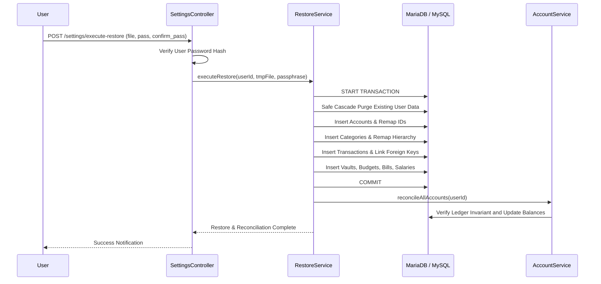

# Institutional Backup, Export & Restoration Engine (v2.0)

This document provides a comprehensive technical manual and architectural reference for the Backup, Export, and Disaster Recovery subsystem of **Expense Tracker Enterprise**.

---

## 1. Architectural Overview & Design Philosophy

Financial recordkeeping platforms demand zero data loss, strict ledger auditability, and protection against both infrastructural failure and hostile exfiltration. The Backup & Export Engine was re-architected around five foundational pillars:

```mermaid
flowchart TD
    subgraph Data Extraction
        DB[(MariaDB / MySQL)] -->|Chunked Cursor O(1) Memory| Engine[Export & Backup Engine]
    end

    subgraph Streaming Pipelines
        Engine -->|UTF-8 BOM + Formula Sanitization| CSV[Streaming CSV]
        Engine -->|Hierarchical v2.0 Schema| JSON[Structured JSON v2.0]
        Engine -->|Pure-PHP Chunked DDL & Inserts| SQL[SQL Database Dump]
    end

    subgraph Security & Compression
        JSON --> GZIP[Gzip Compression Lvl 9]
        SQL --> GZIP
        GZIP --> AES[AES-256-GCM AEAD Encryption]
        AES --> ENC[Encrypted Archive .enc]
    end

    subgraph Restoration & Healing
        ENC --> STAGING[Staging Validator & Dry-Run Preview]
        STAGING --> ACID[ACID Transaction Execution]
        ACID --> RECON[Double-Entry Balance Reconciliation]
    end
```

### Core Design Guarantees
1. **Constant Memory Bounding ($O(1)$ RAM):** All exports stream records in deterministic batches of $500$ rows via unbuffered database queries directly to `php://output` or temporary file descriptors. System memory usage remains strictly below $16\text{ MB}$, even when archiving datasets containing hundreds of thousands of transactions.
2. **Formula Injection Neutralization (CWE-1236):** Direct mitigation against spreadsheet execution attacks by automatically neutralizing cells containing formula trigger characters.
3. **Authenticated AEAD Cryptography:** Backups encrypted with AES-256-GCM and key derivation powered by PBKDF2 (100,000 rounds of SHA-256). Unauthorized modifications fail cryptographic tag verification before database execution.
4. **Staging Preview & Post-Restore Self-Healing:** Restorations execute inside strict PDO transactions with foreign key remapping, concluding with automated double-entry ledger reconciliation to heal any potential drift.

---

## 2. Streaming Export Engine

### 2.1 Formula Injection Sanitization (CWE-1236)
When exporting to CSV format, untrusted user inputs (such as transaction descriptions, merchant names, or account labels) can contain malicious dynamic data exchange (DDE) formula triggers. When opened in Microsoft Excel, LibreOffice Calc, or Google Sheets, formulas beginning with `=`, `+`, `-`, `@`, `\t`, `\r`, or `%` can execute arbitrary operating system commands.

The `ExportService::sanitizeCsvCell` method neutralizes all trigger characters:

```php
public static function sanitizeCsvCell(mixed $value): string
{
    if ($value === null) return '';
    $str = (string) $value;
    if ($str === '') return '';

    // Allow genuine numeric decimals unless prefixed with operators
    if (is_numeric($str) && !in_array($str[0], ['+', '-', '=', '@', '%'], true)) {
        return $str;
    }

    $firstChar = $str[0];
    if (in_array($firstChar, self::FORMULA_TRIGGERS, true)) {
        return "'" . $str;
    }

    $trimmed = ltrim($str);
    if ($trimmed !== '' && in_array($trimmed[0], self::FORMULA_TRIGGERS, true)) {
        return "'" . $str;
    }

    return $str;
}
```

### 2.2 UTF-8 Byte Order Mark (BOM)
To ensure international character glyphs and currency symbols (e.g. `€`, `¥`, `£`, `₱`) render correctly in Microsoft Excel across Windows and macOS environments, all CSV streams are prefixed with the UTF-8 Byte Order Mark:

$$\text{BOM} = \mathtt{0xEF},\, \mathtt{0xBB},\, \mathtt{0xBF}$$

---

## 3. Pure-PHP Chunked SQL Database Dump Driver

Standard MySQL installations frequently operate in shared-hosting, containerized, or restrictive Linux environments where `mysqldump` and `exec()` / `proc_open()` are disabled for security compliance.

`BackupService::generateSqlDump` provides a **100% pure-PHP SQL dumper** that generates standards-compliant, transactional SQL dumps:

- **Topological Sequence:** Tables are extracted in reverse-foreign-key dependency order (`accounts`, `categories`, `employers`, `transactions`, `transaction_splits`, `savings_vaults`, `bills`, etc.).
- **User Scoping:** Every query enforces user ownership boundaries (`WHERE user_id = :uid`), guaranteeing tenant isolation in multi-tenant environments.
- **Chunked Multi-Row Inserts:** Rows are buffered and written in $500$-row `INSERT INTO ... VALUES (...)` blocks, minimizing query parsing overhead during restore.
- **Transactional Wrappers:** Emits `START TRANSACTION;` and `SET FOREIGN_KEY_CHECKS = 0;` preambles with safe `COMMIT;` and `SET FOREIGN_KEY_CHECKS = 1;` closers.

---

## 4. Military-Grade Cryptography & Compression

### 4.1 Cipher & Key Derivation Specifications
Encrypted backups utilize authenticated symmetric encryption conforming to NIST SP 800-38D:

| Parameter | Specification | Purpose |
| :--- | :--- | :--- |
| **Cipher** | `AES-256-GCM` | Authenticated Encryption with Associated Data (AEAD) |
| **Key Derivation** | `PBKDF2-HMAC-SHA256` | Resistant against GPU/ASIC brute-force dictionary attacks |
| **PBKDF2 Iterations** | `100,000` | Exceeds OWASP standard recommendations |
| **Salt Size** | 16 bytes ($128$ bits) | Generated via `random_bytes(16)` per backup |
| **Initialization Vector (IV)** | 12 bytes ($96$ bits) | Standard GCM deterministic non-repeating nonce |
| **Authentication Tag** | 16 bytes ($128$ bits) | Integrity and authenticity verification |
| **Pre-Compression** | `Gzip (Level 9)` | Maximizes entropy and reduces ciphertext size |

### 4.2 Binary Payload Wire Specification
Encrypted archives (`.enc`, `.gz.enc`) adhere to a structured binary framing protocol:

```
+-------------------------------------------------------------------------------+
| Offset | Field                  | Size (Bytes) | Description                 |
+--------+------------------------+--------------+-----------------------------+
| 0x00   | Magic Header           | 6            | ASCII "EXPBKP"              |
| 0x06   | Format Version         | 1            | 0x01 (Version 1)            |
| 0x07   | PBKDF2 Salt            | 16           | Cryptographically random    |
| 0x17   | GCM Initialization Vec | 12           | 96-bit nonce                |
| 0x23   | GCM Authentication Tag | 16           | 128-bit integrity tag       |
| 0x33   | Ciphertext Payload     | Variable     | AES-256-GCM encrypted data  |
+-------------------------------------------------------------------------------+
```

When decrypting, the engine validates the 16-byte authentication tag. If the ciphertext has been modified or the passphrase is wrong, `openssl_decrypt()` rejects the archive immediately without executing corrupt instructions.

---

## 5. Staging-Based Import Validation & Atomic Restoration

Restoring a financial workspace is an all-or-nothing operation. Partial restores can leave ledger balances corrupt, foreign keys broken, or duplicate records inserted.

### 5.1 Staging Dry-Run Preview
The endpoint `POST /settings/preview-restore` conducts an inspection without writing to the database:
1. **Unpack & Decrypt:** Detects encryption header `EXPBKP\x01` and decrypts payload using provided passphrase.
2. **Decompress:** Decompresses Gzip streams (`\x1F\x8B`).
3. **Format Detection:** Dispatches between JSON v2.0 hierarchical payload or SQL dump.
4. **Schema Verification:** Ensures schema version compatibility (`1.0.0` or `2.0.0`).
5. **Entity Inventory:** Computes record counts for every financial module and returns warnings (e.g., currency mismatches, missing parent accounts, or orphaned splits).

### 5.2 Atomic Restore Pipeline
Upon user confirmation with their login password, `RestoreService::executeRestore` executes inside an ACID database transaction:



---

## 6. API & Route Reference

| Method | Endpoint | Description | Parameters |
| :--- | :--- | :--- | :--- |
| `GET` | `/settings/backup` | Download backup snapshot | `format`: `json`, `sql`, `zip`, `xlsx`, `pdf`, `html`, `stream_csv`<br>`passphrase`: (Optional) Encrypts with AES-256-GCM |
| `POST` | `/settings/preview-restore` | Inspect and dry-run preview | `backup_file`: File upload<br>`passphrase`: (Optional) Decryption key |
| `POST` | `/settings/execute-restore` | Atomic restore and reconciliation | `backup_file`: File upload<br>`confirm_password`: User password<br>`passphrase`: Decryption key |
| `POST` | `/settings/delete-all` | Secure cascade wipe of user data | `confirm_password`: User password |
| `GET` | `/reports/export-csv` | Stream monthly expense report | `month`: `YYYY-MM` |
| `GET` | `/salaries/export-csv` | Stream payslip records | None |
| `GET` | `/yearly-review/export-csv` | Stream annual transaction review | `year`: `YYYY` |

---

## 7. Security & Compliance Checklist

- [x] **CWE-1236 Defense:** CSV cells starting with formula triggers (`=`, `+`, `-`, `@`, `\t`, `\r`, `%`) neutralized with leading `'`.
- [x] **OWASP Cryptographic Standards:** AES-256-GCM AEAD encryption paired with PBKDF2 (100,000 iterations).
- [x] **Memory Exhaustion Resilience:** Chunked streaming queries ($500$ rows/batch) enforce $O(1)$ memory overhead ($< 16\text{ MB}$).
- [x] **Zero Shell Dependencies:** Pure-PHP SQL database dump driver eliminates reliance on `exec()` or external `mysqldump` binaries.
- [x] **Audit Trail:** Immutable records stored in `backup_history` and `export_audit_logs` tracking SHA-256 checksums, byte sizes, and timestamps.
- [x] **ACID Restoration Guarantee:** Foreign key remapping inside explicit PDO transactions with automatic post-restore double-entry balance healing.
