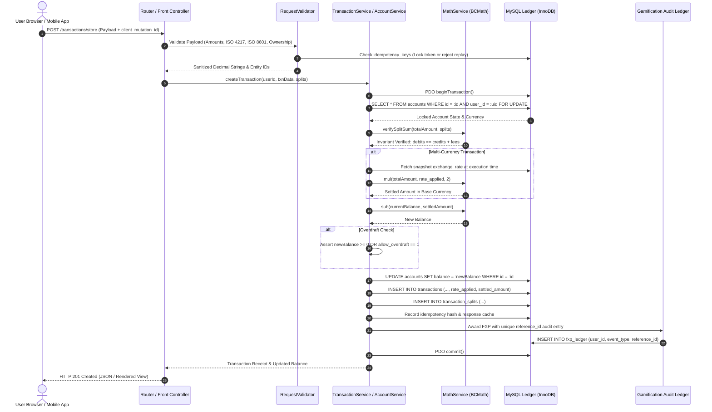

# ExpensePro Financial Operating System (v2.0 Hardened)

> **Enterprise-Grade Personal Finance, Multi-Currency Ledger, & Small Business Operating Platform**  
> *Engineered for zero calculation drift, pessimistic concurrency controls, and double-entry mathematical integrity.*

[](https://www.php.net/)
[](https://www.mysql.com/)
[](https://www.php.net/manual/en/book.bc.php)
[](#concurrency--ledger-integrity)
[](#security-architecture)
[](LICENSE)

---

## Table of Contents

- [Executive Architecture Summary](#executive-architecture-summary)
- [System Architecture & Request Lifecycle](#system-architecture--request-lifecycle)
- [ASCII UI & Fintech Design Tour](#ascii-ui--fintech-design-tour)
- [Installation & Quickstart Guide](#installation--quickstart-guide)
  - [LAMP Stack (Ubuntu/Debian)](#lamp-stack-ubuntudebian)
  - [XAMPP / Local Development](#xampp--local-development)
  - [Docker & Containerized Setup](#docker--containerized-setup)
- [Precision Conventions & Scale Standards](#precision-conventions--scale-standards)
  - [Scale Allocation Matrix](#scale-allocation-matrix)
  - [Banker's Rounding (Round-Half-to-Even)](#bankers-rounding-round-half-to-even)
  - [Double-Entry Ledger Invariant](#double-entry-ledger-invariant)
- [Concurrency & Ledger Integrity](#concurrency--ledger-integrity)
- [Security Architecture & Anti-IDOR Layer](#security-architecture--anti-idor-layer)
- [Automated Ledger Reconciliation](#automated-ledger-reconciliation)
- [Gamification Anti-Exploit Engine](#gamification-anti-exploit-engine)
- [Backup, Export & Disaster Recovery Engine](#backup-export--disaster-recovery-engine)
- [Frequently Asked Questions (FAQ)](#frequently-asked-questions-faq)
- [Contributing & Code Standards](#contributing--code-standards)
- [License & Attributions](#license--attributions)

---

## Executive Architecture Summary

**ExpensePro v2.0** represents a comprehensive re-architecture of the open-source personal finance stack, elevating standard CRUD accounting into a mathematically hardened financial operating system. 

Conventional web-based trackers suffer from subtle, cumulative corruption:
1. **IEEE-754 Floating-Point Drift:** Native PHP/JavaScript float arithmetic (`0.1 + 0.2 = 0.30000000000000004`) causes balance leakages and fractional pennies over split payments.
2. **Race-Condition Overdrafts:** Rapid concurrent requests on mobile or slow connections execute read-modify-write queries without locks, producing balance desynchronization.
3. **Multi-Currency Revisionist History:** Calculating historical budgets using real-time dynamic exchange rates retroactively changes past monthly statements.
4. **Gamification CRUD Farming:** Financial XP (FXP), streak counters, and milestone badges can be exploited via repetitive create-and-delete cycles.

ExpensePro eliminates these failure modes through an **Arbitrary-Precision Math Engine (`bcmath`)**, **Pessimistic Concurrency Controls (`SELECT ... FOR UPDATE`)**, **Multi-Currency Execution Snapshotting**, and **Centralized Anti-IDOR Defensive Validation**.

---

## System Architecture & Request Lifecycle

Every financial mutation follows a strictly guarded pipeline to guarantee ACID atomicity:



---

## ASCII UI & Fintech Design Tour

The interface is inspired by high-trust fintech dashboards (Stripe, Mercury, Copilot), built with WCAG AA compliance, semantic high-contrast tokens, responsive desktop sidebars, and adaptive mobile drawers.

```text
+--------------------------------------------------------------------------------------------------+
|  [Logo] ExpensePro           [Base: USD ($)]   [Search Ctrl+K]   [Profile: Alex Mercer] [Theme]  |
+--------------------------------------------------------------------------------------------------+
|  SIDEBAR           |  FINANCIAL DASHBOARD & PORTFOLIO METRICS                                    |
|                    |                                                                              |
|  * Dashboard       |  +------------------------------------------------------------------------+  |
|  * Accounts (4)    |  | [!] ONBOARDING WIZARD: 3 STEPS TO ZERO-DRIFT CALIBRATION              |  |
|  * Transactions    |  | [x] 1. Base Currency (USD)  [x] 2. Checking Linked  [>] 3. Set Budget  |  |
|  * Budgets         |  +------------------------------------------------------------------------+  |
|  * Savings Vaults  |                                                                              |
|  * Cash Flow       |  +-------------------+  +-------------------+  +-------------------+         |
|  * Analytics BI    |  | MONTHLY INCOME    |  | MONTHLY EXPENSES  |  | NET CASH FLOW     |         |
|  * Gamification    |  | $14,850.00        |  | $3,420.50         |  | +$11,429.50       |         |
|  * System Settings |  | [?] Verified Dep. |  | [?] Settled Debits|  | [?] Operating Net |         |
|                    |  +-------------------+  +-------------------+  +-------------------+         |
|  STATUS MONITOR    |                                                                              |
|                    |  MONTHLY BUDGET ALLOCATION VELOCITY (Overall: 71.4% Consumed)                |
|  Ledger: IN SYNC   |  [========================================.....................]             |
|  ACID Lock: ACTIVE |                                                                              |
|  BCMath: SCALE 2/6 |  CATEGORY PROGRESSION & MULTI-STATE METERS                                   |
|                    |  * Housing / Rent       $1,200.00 / $1,200.00 [===========] 100% [CRITICAL]  |
|                    |  * Food & Groceries       $650.00 /   $800.00 [========...]  81% [CAUTION]   |
|                    |  * Entertainment          $120.00 /   $300.00 [====.......]  40% [SAFE]      |
|                    |  * Business Travel        $540.00 /   $450.00 [###########] 120% [OVERRUN]   |
|                    |    (Overrun bar renders in striped crimson with live deficit pill)           |
|                    |                                                                              |
|                    |  RECENT AUDITED TRANSACTIONS                                                 |
|                    |  DATE       DESCRIPTION        CATEGORY   ACCOUNT     SETTLED      ACTIONS   |
|                    |  2026-10-01 Tokyo Office Supplies Expense   Checking    $124.50 USD  [Reverse] |
|                    |  2026-09-30 Client Retainer     Income    Business   $4,500.00 USD [Receipt] |
|                    |  2026-09-29 Vault Reserve Dep.  Transfer  Savings     $500.00 USD  [Audited] |
+--------------------------------------------------------------------------------------------------+
|  FOOTER: Enterprise ACID Ledger v2.0.0-PROD | Server Time: 2026-10-01 11:24:00 UTC | Latency: 4ms |
+--------------------------------------------------------------------------------------------------+
```

---

## Installation & Quickstart Guide

### Prerequisites
- PHP 8.1, 8.2, 8.3, or 8.4
- Required PHP Extensions: `bcmath`, `pdo`, `pdo_mysql`, `mbstring`, `openssl`, `curl`
- MySQL 8.0+ or MariaDB 10.5+
- Apache / Nginx / Caddy Web Server

### LAMP Stack (Ubuntu/Debian)

1. **Clone the Repository:**
   ```bash
   git clone https://github.com/jakepanlilio2000/Budget-Tracker.git /var/www/html/expenses
   cd /var/www/html/expenses
   ```

2. **Install Required Extensions:**
   ```bash
   sudo apt update
   sudo apt install -y php8.2 php8.2-bcmath php8.2-mysql php8.2-mbstring php8.2-curl php8.2-xml
   ```

3. **Configure Environment Variables:**
   ```bash
   cp .env.example .env
   nano .env
   ```
   Configure your database credentials:
   ```ini
   DB_HOST=127.0.0.1
   DB_PORT=3306
   DB_DATABASE=expensepro
   DB_USERNAME=expense_user
   DB_PASSWORD=SecurePassword123!
   APP_ENV=production
   APP_DEBUG=false
   APP_KEY=base64:your_random_32_byte_secret_key
   ```

4. **Execute Database Migrations:**
   Run the baseline schema followed by the v2 hardening patch:
   ```bash
   mysql -u expense_user -p expensepro < database/migration/schema.sql
   mysql -u expense_user -p expensepro < database/migrations/v2_hardening_patch.sql
   ```

5. **Set Permissions & Webroot:**
   Ensure web server ownership and point your VirtualHost document root to `public/`:
   ```bash
   sudo chown -R www-data:www-data /var/www/html/expenses/storage /var/www/html/expenses/logs
   sudo chmod -R 775 /var/www/html/expenses/storage /var/www/html/expenses/logs
   ```

---

### XAMPP / Local Development

1. Copy repository to `C:\xampp\htdocs\expenses`
2. Enable `extension=bcmath` and `extension=pdo_mysql` in `php.ini`
3. Create database `expensepro` in phpMyAdmin (`http://localhost/phpmyadmin`)
4. Import `database/migration/schema.sql` and `database/migrations/v2_hardening_patch.sql`
5. Configure `.env` with `DB_USERNAME=root` and empty `DB_PASSWORD=`
6. Access application at `http://localhost/expenses/public/`

---

### Docker & Containerized Setup

```dockerfile
# Example Dockerfile for PHP 8.2 + BCMath
FROM php:8.2-apache
RUN docker-php-ext-install bcmath pdo pdo_mysql
RUN a2enmod rewrite
COPY . /var/www/html/
RUN sed -i 's!/var/www/html!/var/www/html/public!g' /etc/apache2/sites-available/000-default.conf
EXPOSE 80
```

Run with `docker-compose up -d`:
```bash
docker compose exec app php bin/migrate.php
```

---

## Precision Conventions & Scale Standards

### Scale Allocation Matrix

Floating point types (`float`, `double`, `real`) are strictly prohibited in the domain layer. All calculations execute as arbitrary-precision strings via `App\Services\MathService`:

| Domain Scope | Scale (Decimal Places) | Storage Format | Rounding Strategy |
| :--- | :--- | :--- | :--- |
| **Ledger Balances & Fiat Money** | `2` | `DECIMAL(15, 2)` | Banker's Rounding (Round-Half-to-Even) |
| **Foreign Exchange Rates** | `6` | `DECIMAL(18, 6)` | Explicit Truncation / Truncate-at-6 |
| **Intermediate Split Ratios** | `6` | Memory String | Scaled to Scale 6 during division |
| **Budget Percentages & Velocity** | `1` or `2` | String / Float Render | Display-only formatting |

### Banker's Rounding (Round-Half-to-Even)

Standard arithmetic rounding (`round($val, 2, PHP_ROUND_HALF_UP)`) introduces systemic statistical upward bias in large financial volumes. `MathService::roundHalfToEven()` operates directly on arbitrary-precision strings without floating-point intermediary conversions:

$$\text{round}(2.505, 2) = 2.50 \quad \text{(even precursor)}$$
$$\text{round}(2.515, 2) = 2.52 \quad \text{(odd precursor rounded up)}$$

### Double-Entry Ledger Invariant

For every transaction containing categorical splits, transfers, or foreign conversions, the system evaluates the fundamental ledger equation down to the last cent:

$$\sum_{i=1}^{n} \text{SplitAmount}_i = \text{TotalTransactionAmount}$$

$$\text{SourceDebit} = \text{DestinationCredit} + \text{TransferFee}$$

If any discrepancy $> 0.00$ is detected, the transaction aborts with a `FinancialException`, and the database state rolls back.

---

## Concurrency & Ledger Integrity

Financial race conditions occur when two threads inspect an account's balance simultaneously before writing changes. ExpensePro implements **Pessimistic Row Locking**:

```php
// Explicit pessimistic lock in AccountModel::findByIdForUpdate()
$stmt = $db->prepare("
    SELECT * FROM accounts 
    WHERE id = :id AND user_id = :user_id 
    FOR UPDATE
");
$stmt->execute(['id' => $accountId, 'user_id' => $userId]);
```

### Deadlock-Free Transfers
When executing inter-account fund transfers, deadlocks can occur if Thread A locks Account 1 $\rightarrow$ Account 2 while Thread B locks Account 2 $\rightarrow$ Account 1. 

`TransactionModel::transfer()` resolves this by **sorting account IDs in ascending order** prior to locking:

```php
$firstId  = min($fromAccountId, $toAccountId);
$secondId = max($fromAccountId, $toAccountId);

// Always lock lower ID first, guaranteeing global lock acquisition ordering
$accountA = AccountModel::findByIdForUpdate($db, $firstId, $userId);
$accountB = AccountModel::findByIdForUpdate($db, $secondId, $userId);
```

---

## Security Architecture & Anti-IDOR Layer

1. **Centralized RequestValidator:**
   - Strict monetary regex validation: `/^\d+(\.\d{1,2})?$/`.
   - Rejects negative inputs, exponential notation (`1e6`), NaN, and string injections.
   - ISO 4217 Currency Code Whitelisting (USD, EUR, GBP, JPY, CAD, AUD, PHP, etc.).
   - ISO 8601 Date Parsing (`Y-m-d`) with business-logic sanity boundaries (no post-dated expenses).

2. **Session-Scoped Ownership Assertions:**
   Every query mutating an entity verifies user context:
   ```php
   RequestValidator::verifyAccountOwnership($db, $accountId, $userId);
   RequestValidator::verifyCategoryOwnership($db, $categoryId, $userId);
   RequestValidator::verifyBudgetOwnership($db, $budgetId, $userId);
   RequestValidator::verifyVaultOwnership($db, $vaultId, $userId);
   ```

3. **Replay & Double-Click Idempotency Guards:**
   Clients send a unique `client_mutation_id` (UUID v4) with mutation requests. The server checks the `idempotency_keys` table. Duplicate submissions within 24 hours are safely rejected or return the cached response without re-executing balance mutations.

---

## Automated Ledger Reconciliation

Historical balances can drift due to legacy bugs, manual database interventions, or edge-case interruptions. 

`AccountService::reconcileAccount($userId, $accountId)` recalculates the true balance directly from immutable ledger history:

$$\text{CalculatedBalance} = \text{InitialBalance} + \sum(\text{Income}) - \sum(\text{Expense}) - \sum(\text{TransfersOut}) + \sum(\text{TransfersIn})$$

- If $\text{StoredBalance} == \text{CalculatedBalance}$, status returns `BALANCED`.
- If a discrepancy is detected, the engine heals the stored account balance and logs an audit reconciliation event in `timeline_events`.

---

## Gamification Anti-Exploit Engine

1. **Idempotent XP Rewards:**
   XP events are recorded in `fxp_ledger` with unique composite constraints (`user_id`, `event_type`, `reference_id`). Re-submitting the same action produces zero additional XP.
2. **Reversal Clawbacks:**
   When a transaction is reversed or deleted via `TransactionService::reverseTransaction()`, all FXP, streaks, and milestone advancements derived from that transaction are atomically clawed back.

---

## Backup, Export & Disaster Recovery Engine

ExpensePro includes an institutional-grade disaster recovery and export engine designed for high-availability environments. See [BACKUP_EXPORT.md](BACKUP_EXPORT.md) for the exhaustive technical manual.

### Dual-Mode Export Architecture
1. **Mode 1: Granular Selection & Filtered Export (CSV / PDF):**
   - **Multi-Select Transactions:** Check individual rows or "Select All" on the ledger table to reveal the floating bulk action toolbar (`Export Selected to CSV`, `Export Selected to PDF`).
   - **Quick Presets:** Instant date resolution for *Current Month*, *Previous Quarter*, and *Year-to-Date (YTD)*.
   - **Dynamic Ledger Computation:** Automatically calculates `Converted Base Amount` on the fly using `MathService::mul($totalAmount, $rateApplied, 2)` if left unpopulated, ensuring zero blank columns.
   - **Executive PDF Statements:** Bank-grade styled financial statements featuring Net Worth cash-flow KPI blocks, tabular numerals (`font-variant-numeric: tabular-nums`), directional pills, and print-CSS page-break optimizations.

2. **Mode 2: Full System Vault Backup (All Relational Tables):**
   - **Complete Relational Export:** Extracts all 27 user-scoped tables: Profile, Preferences, Accounts, Categories, Transactions (splits, tags, exchange rates), Budgets, Recurring Schedules, Bills, Salaries, Vaults, and Gamification Data.
   - **Dual Compressed Formats:** Generates memory-bounded `.json.gz` and pure-PHP `.sql.gz` dumps.
   - **Cryptographic Manifest:** Every vault archive includes a signed `manifest.json` capturing `app_version`, `schema_version`, UTC generation timestamp, table-by-table record counts, and raw payload SHA-256 integrity hash to prevent silent truncation.

3. **PHP 8.4+ Deprecation Compliance & Stream Hygiene:**
   - Explicitly passes delimiter, enclosure, and escape character parameters to `fputcsv($stream, $row, ',', '"', "\\")` across all export services and controllers.
   - Output buffer sanitizer (`cleanOutputBuffer()`) clears active output buffers prior to streaming, preventing PHP warnings or extraneous HTML tags from corrupting downloads.
   - Prepends UTF-8 Byte Order Mark (`\xEF\xBB\xBF`) for native Unicode character rendering in Microsoft Excel.
   - Mitigates CSV Formula Injection (CWE-1236) by neutralizing trigger characters (`=`, `+`, `-`, `@`, `\t`, `\r`, `%`) with single quotes.

4. **Military-Grade Cryptography & Self-Healing Restoration:**
   - Authenticated **AES-256-GCM** encryption paired with **PBKDF2-HMAC-SHA256 (100,000 iterations)** and Gzip Level 9 pre-compression.
   - Staging dry-run validator inspects schemas without database mutation.
   - Atomic PDO restore with foreign key remapping and automatic double-entry balance reconciliation (`AccountService::reconcileAllAccounts`).

---

## Frequently Asked Questions (FAQ)

#### Q: How does ExpensePro handle overdrafts?
**A:** Accounts feature an explicit `allow_overdraft` boolean column. If `allow_overdraft = 0`, any transaction or transfer that would reduce the account balance below `0.00` immediately throws `InsufficientFundsException` and aborts.

#### Q: How are historical multi-currency transactions preserved if exchange rates change?
**A:** When a transaction is posted, the active foreign exchange rate is snapshotted into `transactions.rate_applied`, along with `original_currency_id` and `settled_amount`. Historical reports and budgets always calculate against the snapshotted rate, never live rates.

#### Q: Can I run this in offline mode?
**A:** Yes. `offline.js` stores transactions in browser `IndexedDB`. When network connectivity resumes, transactions sync with a client-generated UUID (`client_mutation_id`), ensuring zero duplicate entries.

---

## Contributing & Code Standards

We welcome contributions from financial engineers, security researchers, and UI/UX designers! Please review [CONTRIBUTING.md](CONTRIBUTING.md) for branch management rules, PHP 8 strict-typing guidelines, and BCMath unit test procedures.

---

## License & Attributions

This project is licensed under the **MIT License** - see the [LICENSE](LICENSE) file for full details.  
Architected with pride by Jake Panlilio and the open-source engineering community.
